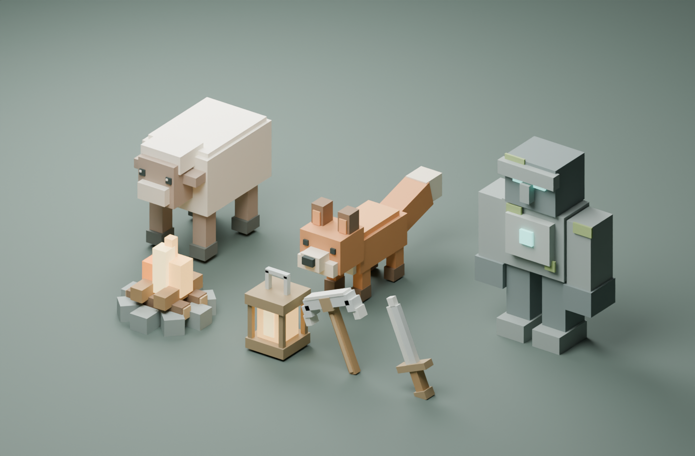
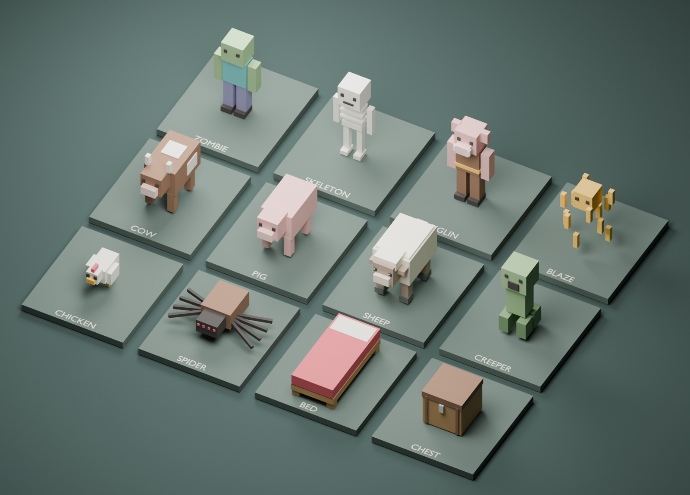

# Voxel Wilds

A singleplayer voxel sandbox with seeded terrain, crafting, survival and a Nether dimension.
Built with JavaScript, Three.js and Electron, with editable Blender models.

## Play on Windows

Use one of the files in `release/1.2.0/`:

- `Voxel-Wilds-Portable-1.2.0.exe`: run directly. Keep it in a writable folder.
- `Voxel-Wilds-Setup-1.2.0.exe`: install with desktop and Start menu shortcuts.
  The installation includes `Uninstall Voxel Wilds.exe`.
- `Voxel-Wilds-Uninstall-1.2.0.exe`: opens the installed game's uninstaller.

Friends only need the portable EXE or the setup EXE. Node.js, Chrome, Blender and an
internet connection are not required to play. The builds target 64-bit Windows.
A mouse, keyboard and hardware-accelerated graphics are required.

These builds are unsigned. Windows may display a publisher or SmartScreen warning.
Share the checksum file along with the EXE so recipients can verify the download.

To uninstall an installed copy, use Windows Settings > Apps > Voxel Wilds, or run
`Uninstall Voxel Wilds.exe` from its installation folder. Saved worlds are retained.
The portable version has no installer: remove its EXE when you no longer want it;
keep its `userdata/` folder if you want to retain worlds.

## Controls

| Input                 | Action                                                    |
| --------------------- | --------------------------------------------------------- |
| W, A, S, D            | Move                                                      |
| Mouse                 | Look                                                      |
| Space                 | Jump or swim up                                           |
| Ctrl                  | Sprint                                                    |
| Shift                 | Sneak or fly down                                         |
| Hold left mouse       | Mine or attack                                            |
| Right mouse           | Place, use a bed, open a station/chest or ignite a portal |
| Hold right mouse      | Eat food or block with a shield                           |
| Middle mouse          | Pick a block in Creative                                  |
| 1-9 or mouse wheel    | Select a hotbar slot                                      |
| E                     | Inventory                                                 |
| F                     | Swap selected item with offhand                           |
| Q / Ctrl+Q            | Drop one item / a stack                                   |
| Double-tap Space or G | Toggle Creative flight                                    |
| H                     | Controls and crafting help                                |
| Esc                   | Pause, close a screen or leave a bed                      |
| F11                   | Fullscreen                                                |

Walking into a block does not jump automatically. Creative is invulnerable;
damage, hunger and tool wear apply in Survival.

## Survival and the Nether

The Overworld has a 20-minute day/night cycle. Zombies, skeletons, creepers and
spiders spawn at night in Survival. Zombies and skeletons burn in direct daylight.
Monsters chase, attack and take knockback. Skeletons shoot arrows, blazes throw
fireballs and creepers explode. Shields block attacks and armor reduces damage.

Cows, pigs, sheep and chickens drop raw meat when killed. Pick it up, cook it in a
furnace and hold right mouse to eat. Sheep also drop wool for beds.

Craft a bed at a table with three wool above three planks. Place it on two clear
blocks of solid ground. Right-click it to set your respawn point. At night, with
no monsters nearby, sleeping advances time to dawn. Esc leaves the bed early.
After death, inventory drops and you respawn automatically after three seconds.
An intact, unobstructed bed is used first; otherwise you return to the world spawn.
There is no manual respawn button or pause-menu teleport to spawn.

Mine obsidian using a crystal pickaxe. Build a frame four blocks wide and five
high, with a two-by-three opening. The four corners are optional, so ten obsidian
are enough. Craft flint and steel from flint and an iron ingot placed diagonally,
then right-click the inside edge of the frame. Stand in the portal for four
seconds in Survival, or briefly in Creative, to travel. Portals link both ways
with an 8:1 coordinate scale. Each dimension keeps its own terrain edits, mobs,
chests, furnaces and dropped items.

Explore the Nether for lava, glowstone, nether gold, soul sand, fortress bridges
and ruined bastions. Fortresses have wither skeletons, blazes, spawners and wart;
bastions have piglins, brutes and treasure chests. A gold helmet keeps ordinary
piglins neutral until provoked by an attack, opening a chest or mining gold.
Brutes remain hostile. Beds explode in the Nether. Death there returns you to
your Overworld bed or world spawn.

Creative's Mobs category contains spawn eggs for the new animals and monsters.

## Inventory and crafting

The inventory follows Java Edition's layout: 27 storage slots, a nine-slot
hotbar, four armor slots, an offhand slot and a 2x2 personal crafting grid.
Right-click a placed crafting table for the 3x3 grid.

Left-click picks up, moves or merges a stack. Right-click takes half or places
one item. Shift-click transfers items. Drag across slots to distribute a stack;
right-drag places one per slot. Double-click collects matching items. Number keys
swap the hovered slot with the corresponding hotbar slot.

Recipes use shaped patterns and allow translation and horizontal mirroring.
The recipe book arranges available ingredients; click the output to craft,
or Shift-click it to craft as many as fit. Larger recipes require a table.

A log makes four planks. Four planks in a square make a table. Two planks placed
vertically make four sticks. Pickaxes need three materials across the top row
and two sticks below the center. A furnace needs eight cobblestone around an
empty center. Furnaces smelt raw iron, clay, sand and other supported inputs,
with fuel in the lower slot.

Stacks hold up to 64 items; beds, tools, armor and shields occupy individual slots.
Durability is saved per item and equipment breaks at zero. Full inventories
leave excess items on the ground. Inventory screens do not pause Survival;
press Esc to pause safely. On death, items drop and remain for five minutes.
Chests have 27 persistent slots. Shift-click transfers stacks between a chest and
your inventory. Breaking a chest spills its stored items.

## Graphics and difficulty

Settings include FPS caps from 30 to 240 and Unlimited, render scale, brightness,
view distance, fog distance, entity distance, field of view, shadow quality,
particles, clouds, view bobbing and vignette. Lower render scale and disable
shadows for better performance. Unlimited removes the game's frame cap; the
browser may still limit rendering to the display refresh rate. The desktop build
supports uncapped rendering. Higher limits can increase power use and GPU heat.

Peaceful removes hostile mobs. Easy, Normal and Hard adjust incoming mob damage.
Creative remains invulnerable regardless of difficulty.

## Worlds and saves

| Run mode                             | Save location                    |
| ------------------------------------ | -------------------------------- |
| Source launcher or `npm run desktop` | `Game/saves/`                    |
| Portable EXE                         | `userdata/saves/` beside the EXE |
| Installed EXE                        | `%APPDATA%/Voxel Wilds/saves/`   |

Worlds are JSON files. Autosave runs every 20 seconds of play, on pause, when
closing inventory, and before quitting. Each world retains its previous valid
save as a `.bak` file. An unreadable primary save falls back to that backup.

Version 1 and 2 worlds load and migrate to version 3 automatically, keeping terrain
edits, inventory and equipment. Version 3 saves are not compatible with older game
releases. Back up your worlds before upgrading. Close the game before copying saves between versions or PCs.
Do not run two copies against the same save folder. Keep the game open if a save
error appears.

## Development

Install Node.js 22.12 or newer, then run these commands from this folder:

```powershell
npm ci
npm run setup:desktop
npm run desktop
```

For browser play, use `npm start`. The launcher starts a loopback-only server and
opens the game. Do not open `index.html` directly. `Play Voxel Wilds.bat` prefers
the built desktop app when present, keeping the existing worlds in `Game/saves/`;
otherwise it starts the browser version.

```powershell
npm test
npm run test:browser
npm run test:desktop
npm run format:check
npm run build:win
npm run test:portable
```

The browser tests use Chrome at its usual Windows installation path. Set
`CHROME_PATH` to use a different installation. Tests use isolated worlds under
`.cache/`; screenshots and reports go to `artifacts/`. Desktop tests run in a
hidden window. Set `VOXEL_PACKAGED_EXE` to test the unpacked release executable.

`npm run test:installer` installs into an isolated test folder, runs the desktop
test, then uninstalls it and verifies that its save survives. It refuses to
overwrite an existing installed copy. `node scripts/check-saves.mjs` checks local
world migrations on temporary copies without modifying the original saves.

The Windows build creates an NSIS setup installer and a portable EXE.
Build files, downloads and package caches stay in this project folder.
A fresh build needs internet access to download dependencies and packaging tools.

## Blender models

`assets/models/` contains the nineteen GLB models loaded by the game.
`assets/blender/` contains their editable sources and collection scenes.
The game never runs Blender at runtime.





To regenerate the assets with Blender 4.5:

```powershell
blender --background --factory-startup --python scripts/build_models.py
blender --background --factory-startup --python scripts/build_survival_models.py
blender --background --factory-startup --python scripts/render_survival_gallery.py
```

Regeneration replaces the generated model files. Save hand-edited variants
under different names first.

## Scope and license

This is an independent Minecraft-inspired sandbox, not a complete Minecraft
implementation. It includes the crafting patterns for its available items, not
Minecraft's entire item catalog. Structures and models are original interpretations,
not copies of Minecraft assets. There is no End dimension or Ender Dragon,
multiplayer, redstone, animal breeding, full farming system, enchanting, brewing
or fluid simulation. Water and lava are static, portals use the four-by-five frame,
and building is limited to Y 1-71. Only the mobs and mechanics described above are
implemented; this is not full Minecraft feature parity.

Code and original assets use the [MIT license](LICENSE).
See [third-party notices](THIRD_PARTY_NOTICES.md) for dependencies and trademarks.
